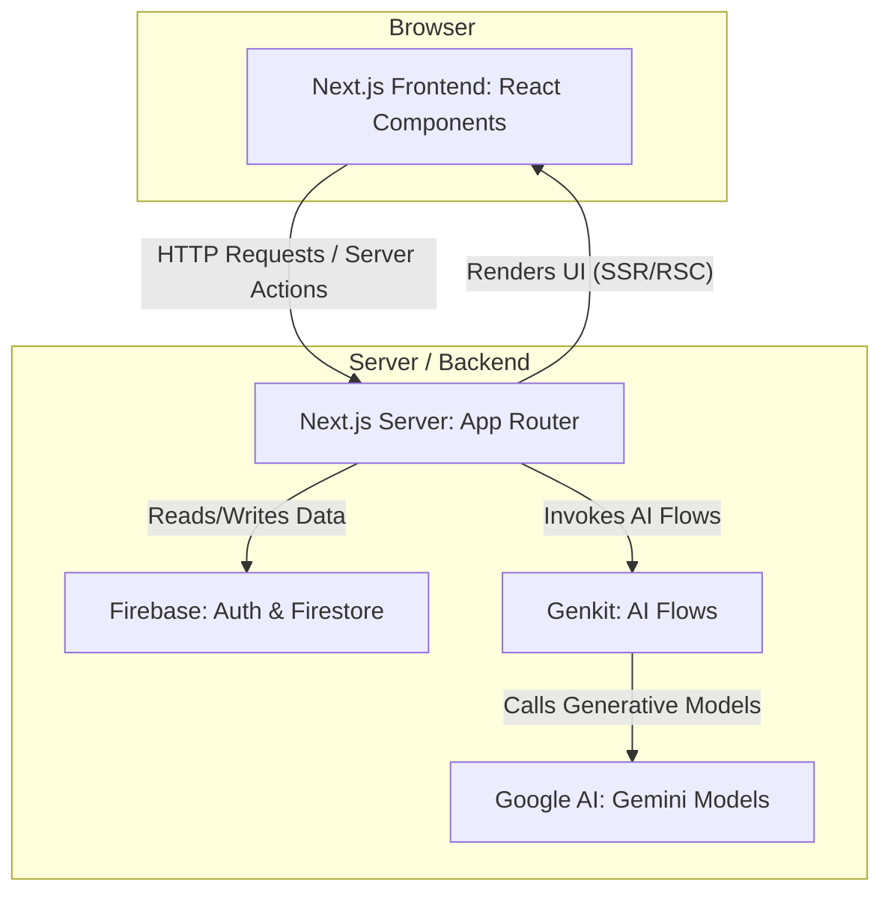

# JobTrack Application Architecture

This document provides a high-level overview of the technical architecture for the JobTrack application.

## 1. High-Level Overview

JobTrack is a modern, full-stack web application built on the **Next.js** framework. It uses **Firebase** for its backend services (Authentication and Database) and **Genkit** with Google's Gemini models for its AI-powered features. The architecture is designed to be scalable, secure, and maintainable, leveraging a server-centric approach with the Next.js App Router.



## 2. Frontend Architecture

The frontend is built with **React** and **Next.js**, utilizing the App Router for routing and server-side rendering.

-   **Framework**: [Next.js 14+](https://nextjs.org/) with the App Router. This enables a mix of Server Components (RSC) for performance and Client Components for interactivity.
-   **Language**: **TypeScript** for type safety and improved developer experience.
-   **UI Components**: A combination of custom components and primitives from [shadcn/ui](https://ui.shadcn.com/). This provides a flexible and accessible design system.
-   **Styling**: [Tailwind CSS](https://tailwindcss.com/) is used for all styling, configured with a custom theme in `src/app/globals.css`.
-   **State Management & Data Fetching**:
    -   Client-side state is managed with React hooks (`useState`, `useEffect`, `useContext`).
    -   The `useFirebase` hook provides a centralized context for accessing Firebase services (Auth, Firestore) and user state throughout the application.
    -   Data from Firestore is fetched in real-time using custom hooks (`useCollection`, `useDoc`) that wrap `onSnapshot` listeners.

## 3. Backend & Data Architecture

The backend is powered by Google's Firebase platform, which handles authentication and data storage securely.

-   **Authentication**: [Firebase Authentication](https://firebase.google.com/docs/auth) manages user sign-up and login. It supports Google Sign-In and traditional email/password methods. User sessions are managed automatically by the Firebase SDK on the client.
-   **Database**: [Cloud Firestore](https://firebase.google.com/docs/firestore) is used as the primary NoSQL database.
    -   **Data Model**: The database follows a user-centric, hierarchical structure. All user-specific data (like applications, resumes, etc.) is stored in subcollections under that user's unique document. This is a best practice for security and scalability.
      ```
      /users/{userId}/
        - applications/{applicationId}
        - resumeFeedback/{feedbackId}
        - coverLetters/{coverLetterId}
      ```
    -   **Security**: [Firestore Security Rules](firestore.rules) enforce a strict ownership model. The rules ensure that a user can only read and write data located within their own document path (e.g., `/users/{request.auth.uid}/...`). This prevents data leakage between users.

## 4. AI Integration (Genkit)

All generative AI features are implemented using **Genkit**, a framework for building production-ready AI applications.

-   **Framework**: [Genkit](https://firebase.google.com/docs/genkit) orchestrates calls to large language models (LLMs). It allows for structured, testable, and maintainable AI code.
-   **AI Flows**: Each distinct AI task is encapsulated in a "flow," which is a server-side function defined with Genkit. All flows are located in `src/ai/flows/`.
    -   `resume-feedback.ts`: Analyzes an uploaded resume file and provides a score, suggestions, and keyword optimizations.
    -   `cover-letter-generation.ts`: Generates a cover letter based on resume text and an optional job description.
    -   `job-search.ts`: Generates a list of fictional job postings based on a user's query.
    -   `email-parser.ts`: Extracts structured job application data from raw email text.
-   **Models**: The flows use **Google's Gemini models** (e.g., `gemini-pro`) via the `@genkit-ai/googleai` plugin.
-   **Data Handling**: For flows requiring file input (like resume analysis), the client converts the file into a Base64-encoded data URI before sending it to the server-side flow.

## 5. Key Directories

-   **/src/app/**: Contains all pages and layouts for the Next.js App Router. Each folder represents a route.
-   **/src/components/**: Home to all reusable React components, organized by feature (e.g., `dashboard`, `auth`) and UI primitives (`ui`).
-   **/src/firebase/**: Contains all Firebase-related logic, including the configuration, provider, and custom hooks for interacting with Firestore.
-   **/src/ai/**: Houses all Genkit code, including the central `genkit.ts` configuration and the individual `flows`.
-   **/src/lib/**: A collection of shared utilities, type definitions (`types.ts`), and static data.
-   **/docs/**: Contains the `backend.json` file, which serves as a blueprint for the app's data structures.

